# Procesverslag
Markdown is een simpele manier om HTML te schrijven.  
Markdown cheat cheet: [Hulp bij het schrijven van Markdown](https://github.com/adam-p/markdown-here/wiki/Markdown-Cheatsheet).

Nb. De standaardstructuur en de spartaanse opmaak van de README.md zijn helemaal prima. Het gaat om de inhoud van je procesverslag. Besteedt de tijd voor pracht en praal aan je website.

Nb. Door *open* toe te voegen aan een *details* element kun je deze standaard open zetten. Fijn om dat steeds voor de relevante stuk(ken) te doen.

## Jij

  
uitwerken voor kick-off werkgroep

  ### Auteur:
  Mohini Ramtahalsing
  #### Je startniveau:
  Tussen blauw een rood. Ik heb wel wat meer ervaring met coderen, maar ik ben er in mijn mening nog steeds niet heel goed in, maar wil wel het meest voor rood gaan als uitdaging. 

  #### Je focus:
  Responsive
 

## Je website

  
uitwerken voor kick-off werkgroep

  ### Je opdracht:
 [ Paradiso](https://www.paradiso.nl/en)

  #### Screenshot(s) van de eerste pagina (small screen): 
  Homepagina/ What's on
  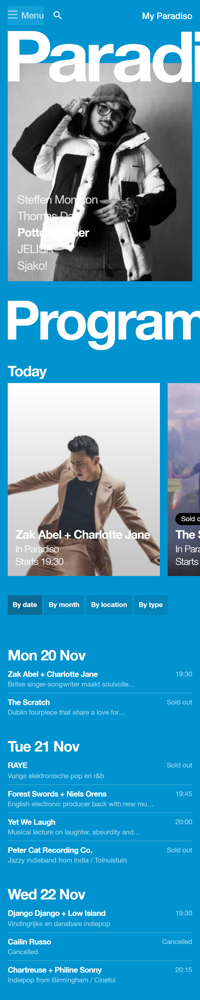

  #### Screenshot(s) van de tweede pagina (small screen):
  News pagina
  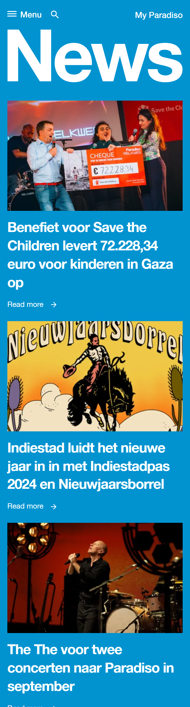
 

## Toegankelijkheidstest 1/2 (week 1)

  
uitwerken na test in 2e werkgroep

  ### Bevindingen
  Lijst met je bevindingen die in de test naar voren kwamen:
  Tijdens het analyseren van de website kwam ik er meteen achter dat ze website niet heel toegankelijk is voor mensen met mobiele beperkingen. Want het navigeren door de website met alleen toetsenbord is niet duidelijk. De feedback op de focus state is niet goed te zien. De achtergrond van de website is blauw, maar de focus is ook een net lichtere kleur blauw. Dit zorgt ervoor dat je niet goed ziet waar je op staat tijdens het navigeren.
  De tekst is wel te lezen met blurred vison door het sterke kleur contrast. Alle vormen van kleurenblind kunnen moeiteloos deze site gebruiken. Tijdens het gebruik van Narrator kwam ik er achter dat de Voice over alles goed uitlegt, alleen als je door de website tabt, gaat hij eerst het hele menu op lezen voordat je de pagina kan gebruiken, ookal heb je niet op menu geklikt. Dus dat moet veranderen. Ook ben ik er tijdens het gebruik van de checklist achter gekomen dat ze in de code bijna geen alt attribute gebruiken voor images

  
  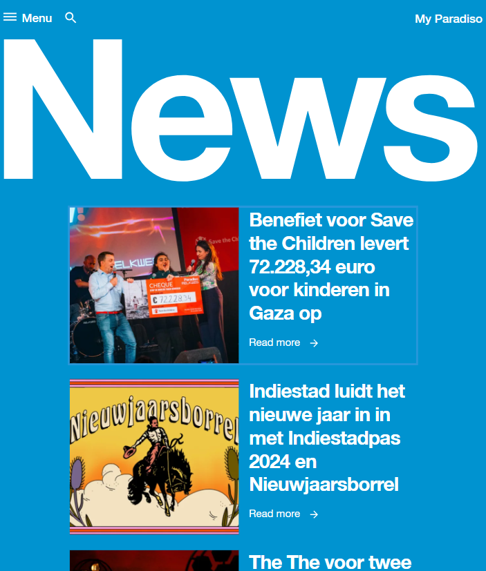
  Ook tijdens het responsive kijken, kwam ik erachter dat de titel tekst half van het scherm gaat als je op moblie schermen zit. 
  

## Breakdownschets (week 1)

  
uitwerken na afloop 3e werkgroep

  ### de hele pagina: 
  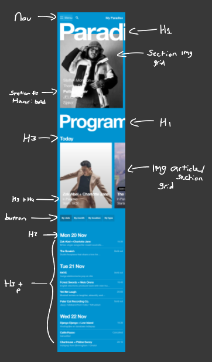
   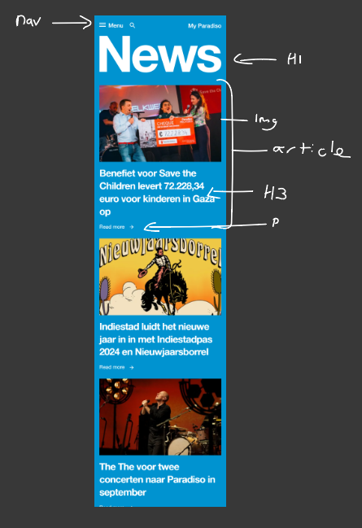

  ### dynamisch deel (bijv menu): 
  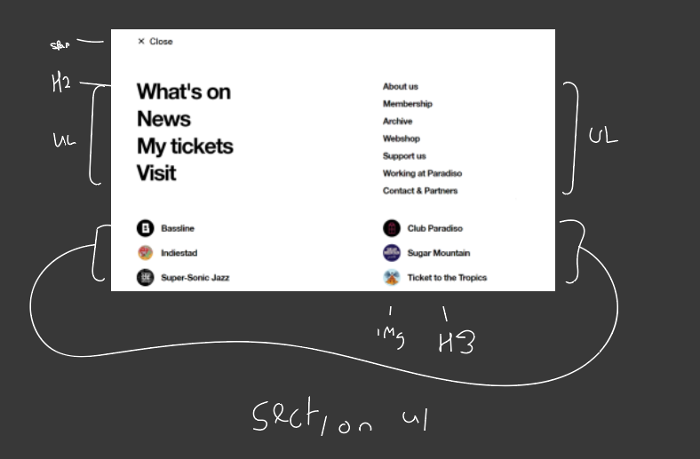

## Voortgang 1 (week 2)

  
uitwerken voor 1e voortgang

  ### Stand van zaken
  Ik ben goed begonnen met het maken van mn html. Dat ging best wel soepel, ik kon makkelijk gebruik maken van sections en ul's. Door al de structuur te hebben, heb ik het veel makkelijker gemaakt voor mezelf om goed te stijlen. Ik had wel nog een beetje moeite met het uitvogelen van van de responsive grid naar image carousel. 

  ### Agenda voor meeting
  samen met je groepje opstellen (ik ben een herkanser, dus ik heb geen contact met de klas. Ook weet ik de namen niet van alle mensen. Dus ik noem ze in mijn verslag even student 1,2 en 3. Ik heb wel hun vragen opgeschreven. )

  | student 1      | student 2          | student 3    | Mohini        |
  | ---            | ---                | ---          | ---              |
  |  kijken of html werkt  | vragen over github            | Zal ik responsive of service plane  | hoe moet ik de grid goed vormgeven    |
  |  |  |  |  |
  | ...            | ...                | ...          | ...              |

  ### Verslag van meeting
 Ik heb tijdens de meeting mijn website even laten zien, en dit is wat ik uit het gesprek heb gehaald. 

  - Ik kan het simpel houden. Ik hoef niet per se een img carousel in mijn website te zetten
  - Ik kan ervoor kiezen om 1 image te laten zien naarmate de site kleiner wordt
  - Ik ben goed op weg, ik ga gewoon door met werken
  - ...

## Voortgang 2 (week 3)

  
uitwerken voor 2e voortgang

  ### Stand van zaken
  Ik heb gewerkt aan de tweede pagina, en heb een beetje de rest gepositioneerd. Ik wil toch het grid goedkrijgen, maar dat is moeilijker dan verwacht. Ik wil dat graag vragen tijdens mijn voortgangsgesprek.

  ### Agenda voor meeting
  samen met je groepje opstellen (ik ben een herkanser, dus ik heb geen contact met de klas. Ook weet ik de namen niet van alle mensen. Dus ik noem ze in mijn verslag even student 1,2 en 3. Ik heb wel hun vragen opgeschreven. )

  | student 1      | student 2          | student 3    | Mohini      |
  | ---            | ---                | ---          | ---              |
  | Problemen met github  |             |    | Ik wil toch hetzelfde grid als in de site    |
  |  |  |  | |
  | ...            | ...                | ...          | ...              |

  ### Verslag van meeting
Ik heb van donna hulp gehald met het opzetten van de grid, ik ga het zelf toepassen in mijn site. Ook heeft ze me een tip gegeven over hoe ik met een simpele javascript functie intersect, ervoor kan zorgen dat de tekst in beeld vliegt tijdens het scrollen. Ik ga nu verder met het responsive maken van mijn 2e pagina, en het maken van mijn hamburgermenu (micro interactie)
  - Grid ga ik nu fixen en responsive maken
  - Intersect ga ik toevoegen
  - Micro interactie maken
- ...

## Toegankelijkheidstest 2/2 (week 4)

  
uitwerken na test in 9e werkgroep

  ### Bevindingen
  Lijst met je bevindingen die in de test naar voren kwamen (geef ook aan wat er verbeterd is):

  In mijn eerste bevindingen was ik hier achter gekomen:
  -Want het navigeren door de website met alleen toetsenbord is niet duidelijk (focus state)
  - in de code bijna geen alt attribute gebruiken voor images
  - De screenreader leest teveel op

    Ik heb in mijn site die dingen zo goed mogelijk geprobeerd op te lossen.
    - Ik heb een focus state toegevoegd van een witte rand om de knoppen heen. Het is duidelijker te zien, en het pas in het thema. Ik had persoonlijk nog wel gewild dat ze er mooier omheen zaten, maar ik wist niet zo goed hoe ik dat moest fixen.
    - Ik heb bij elke image in mijn html pagina's een alt attribute toegevoegd
    - Ook heb ik er voor gezorgd dat je tijdens het tabben, en een screenreader gebruiken, niet meer door het hele menu moet gaan terwijl die niet open is.
    - Ook ben ik er tijdens het coderen achter gekomen dat er heel veel tekst over afbeeldingen heen staat, wat niet zo toegeankelijk is voor sommige mensen. Dus ik heb alle tekst over een plaatje een achtergrond gegeven, zodat het contrast beter is.
    - Nog een ding waar ik tijdens het coderen achter kwam, wat ik heb gemist in mijn eerste onderzoek, was de uitleg tekst van de artiesten voldeden niet aan de Accessibility contrast, dus ik heb die tekst beter contrast gegeven.

## Voortgang 3 (week 4)

  
uitwerken voor 3e voortgang

  ### Stand van zaken
  Ik heb deze week alles helemaal goed gepositioneerd, en alle html content afgemaakt. Alles staat nu goed, op de juiste plek. Dus deze week ga ik alles heel mooi responsive maken, en ik wil ook nog wat surface plane effecten toevoegen, want dat vind ik wel een leuke uitdaging. 

  ### Agenda voor meeting
  Als herkanser hoefde ik niet lang te blijven, dus ik heb zelf maar 1 vraag

  | Mohini      | student 2          | student 3    | student 4        |
  | ---            | ---                | ---          | ---              |
  | Hoe kan ik het best de 2e pagina met dezefde css vormgeven  | vraag over footer             | ...    | ....   |
  |  |  | ... | .... |
  | ...            | ...                | ...          | ...              |

  ### Verslag van meeting
 Ik heb mijn vraag gesteld, en ik kreeg het antwoord van het gebruik van een attribute selector. 

  - Alles gaat prima en soepel, ik ga nog een goede toegankelijkheidstest doen als ik verder ben met de states. 

## Eindgesprek (week 5)

  
uitwerken voor eindgesprek

  ### Je uitkomst - karakteristiek screenshots:
ik heb voor mijn Frontend Development herkansing de website van Paradiso gemaakt. Ik ben best wel tevreden met mijn website. Vorig jaar had ik de site van Dutch Comiccon geprobeerd te maken, maar als ik daar nu op terug kijk is dat echt een hele slecht gemaakte site. Ik heb nu iets meer ervaring met html en css. Zelfs Javascript kan ik nu best wel oke. 
  
  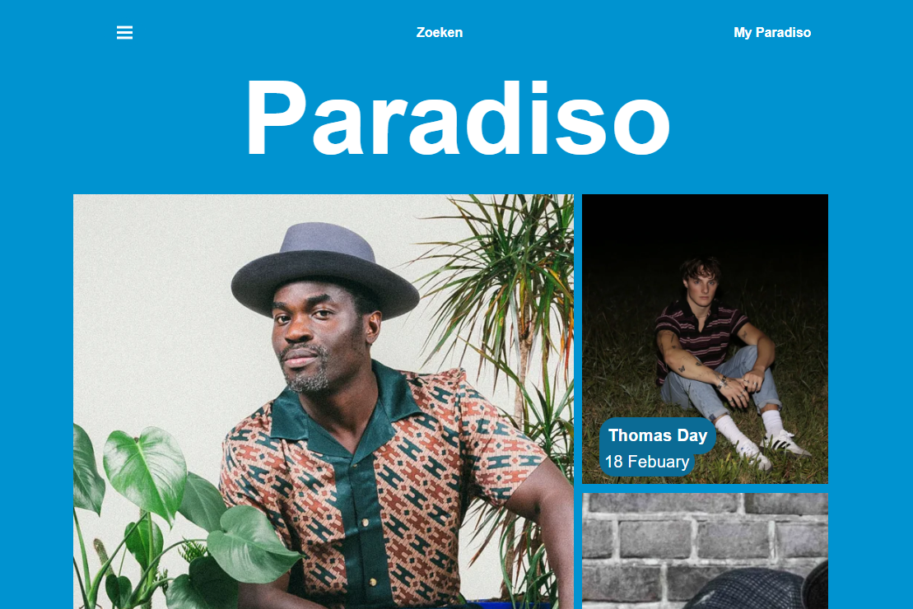
  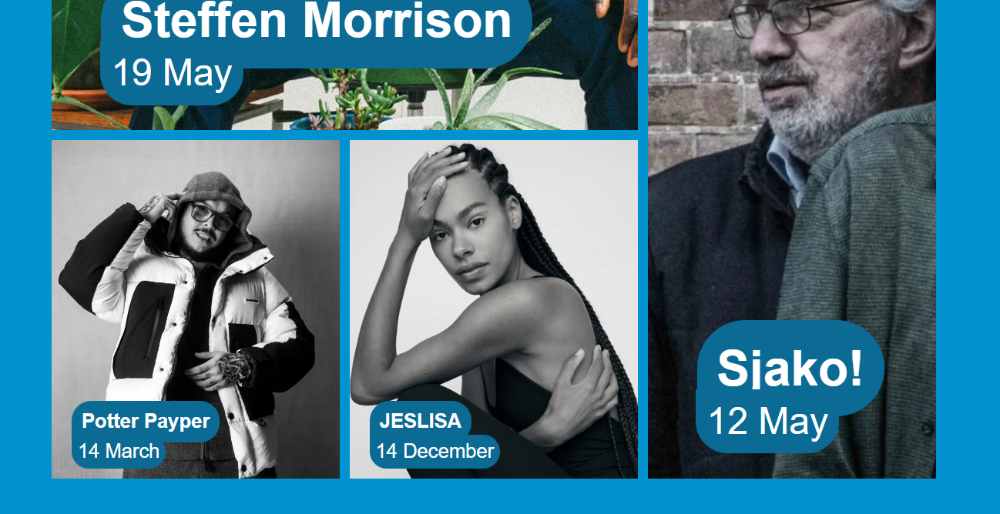

  ### Dit ging goed/Heb ik geleerd: 
  Ik heb geleerd om met behulp van media querys een compleet andere layout te kunnen maken. Ik heb vorig jaar voor de surface plane gekozen, dus ik heb dit helemaal nooit gebruikt. Ik vind het echt een toffe en handige functie, die ik zeker in de toekomst ga gebruiken. 

  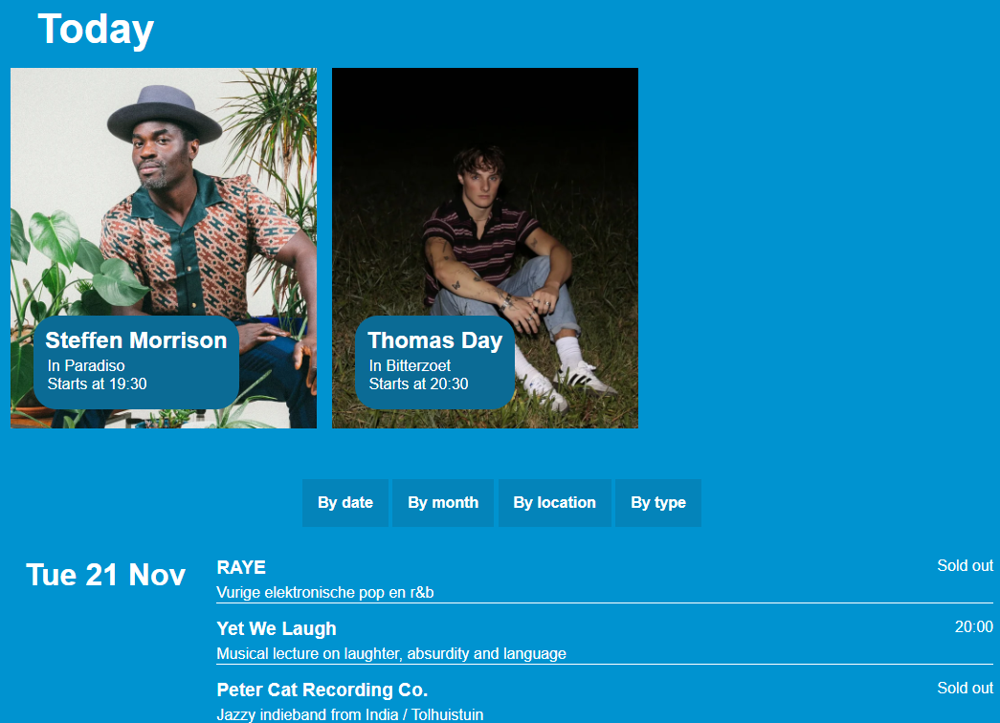
  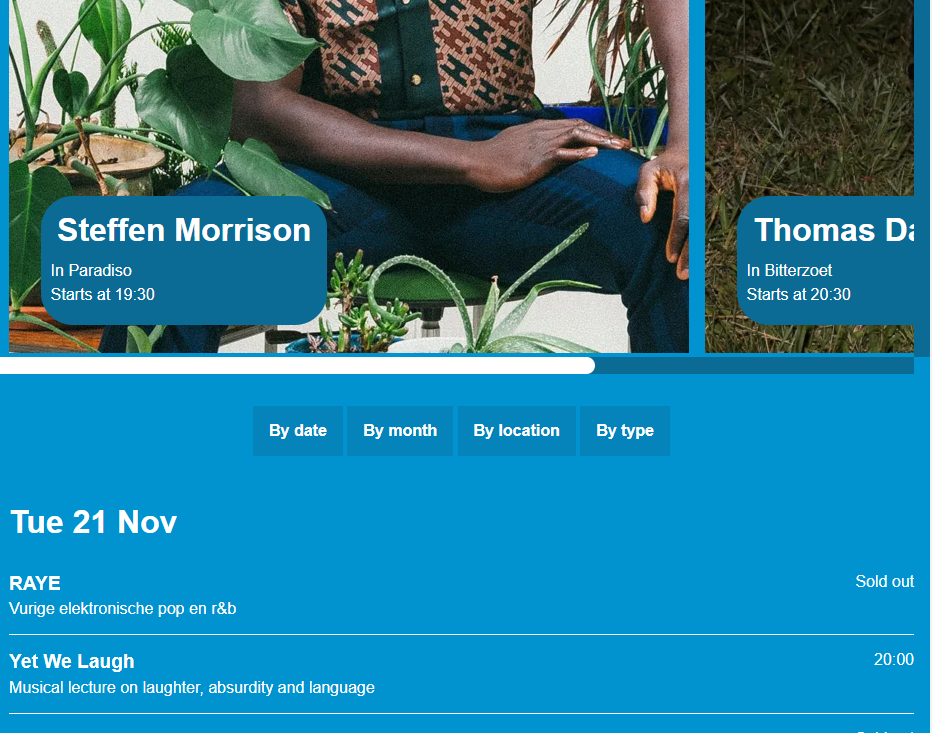

  ### Dit was lastig/Is niet gelukt:
  Ik had eenn beetje moeite met het maken van het hamburger menu. Ik had uiteindelijk wat code gebruikt van sanne uit een oefening, maar die bleek ook niet te werken in mijn website. Dit vind ik erg jammer, want het knopje blijft nu gewoon drie streepjes. 
  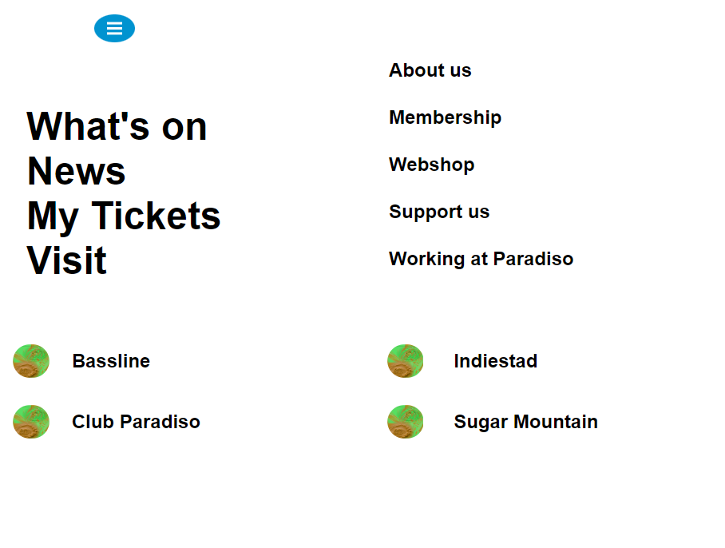

## Bronnenlijst

  
continu bijhouden terwijl je werkt

  Nb. Wees specifiek ('css-tricks' als bron is bijv. niet specifiek genoeg). 
  Nb. ChatGpT en andere AI horen er ook bij.
  Nb. Vermeld de bronnen ook in je code.

  1. [bron 1](https://codepen.io/d0nnaz/pen/PoVyNQp?editors=1100)https://codepen.io/d0nnaz/pen/PoVyNQp?editors=1100 Donna's code voor de layout van de grid op de homepage.
  2. [bron 2](https://codepen.io/shooft/pen/mdayVeo)https://codepen.io/shooft/pen/mdayVeo Ik heb wat code gehaald uit de grid oefening van Sanne.
  3. https://www.w3schools.com/css/css_overflow.asp
https://developer.mozilla.org/en-US/docs/Web/CSS/Attribute_selectors
https://www.w3schools.com/css/css3_mediaqueries.asp
https://www.w3schools.com/css/css3_mediaqueries.asp
https://w3schools.com/howto/howto_css_image_responsive.asp
chrome-extension://efaidnbmnnnibpcajpcglclefindmkaj/https://dlo.mijnhva.nl/content/enforced/536499-FDMCI-2000FED121-DMCI-CMD-2324-2/FED%2023-24%20-%20Blok%202%20-%20Oefening%20grid.pdf
https://codepen.io/shooft/pen/LYMEWVm
https://css-tricks.com/almanac/properties/s/scrollbar/  

